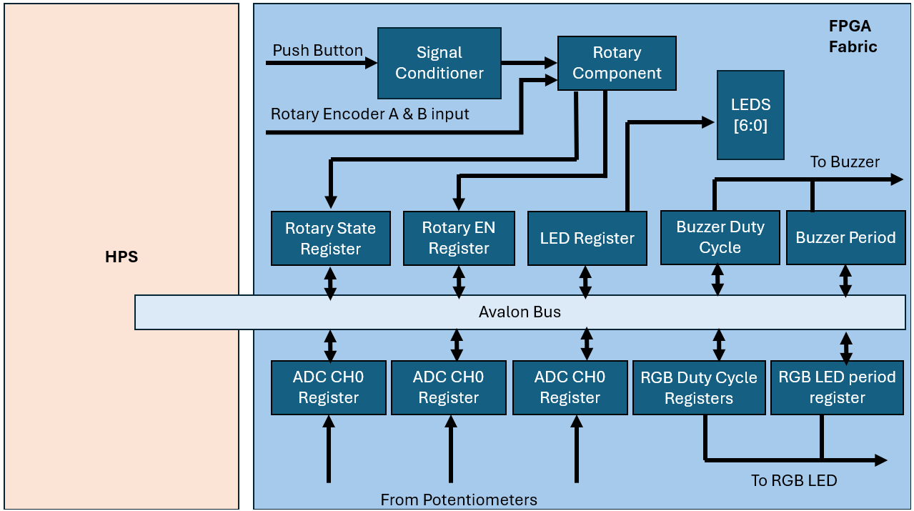

# EELE 467 FPGAs Hardware Software Codesign Final Project
Montana State University Fall 2024

Seth Howard and Dirk Kaiser

## System Overview
The System we created for this final project included the required RGB LED controlled by potentiometers, as well as a buzzer controlled by user input and rotary encoder. The following block diagram outlines the project.

## Custom Component 1: Rotary Encoder
The first custom component of the project is a Rotary Encoder, implemented using VHDL to capture both the rotational state and the button press of the encoder. Detailed information about the VHDL implementation can be found in the [README](../hdl/rotary/README.md). A Linux device driver was then employed to read the encoder state and the button enable registers from the FPGA fabric. This enables interaction with the encoder data from a C program once the kernel module is loaded.

For this project, two C programs were developed to utilize the rotary encoder. The first program reads the encoder state and writes the information to a custom LED device, providing a visual indication of the encoder's rotation. The second program uses the encoder input to control the volume of a buzzer component (described later) by adjusting its frequency based on the user's setting.
## Custom Component 2: Buzzer
The second custom component was a piezo buzzer that could be controlled with a rotary encoder and from the command line. The rotary encoder would enable or disable the buzzer with a button click, and change the duty cycle of the PWM signal with a turn. The LED array on the de10nano was tied to this functionality, as the LEDs would indicate the volume level being driven to the buzzer. A simple buzzer driver circuit was built in which the control signal was placed on the base of a NPN BJT and a flyback diode was placed across the terminals of the buzzer. A VHDL component was created for the buzzer with a register for the volume (duty cycle of the PWM signal) and a register for the pitch (period of the PWM signal). The user could enter a frequency in Hz on the command line and the software would convert it to a period in milliseconds with the proper fixed point notation, then write to the pitch register. This software also included the enable/disable functionality, where it would read the state of the button press on the encoder and enable or disable the PWM signal accordingly. Another piece of software would read the state of the rotary encoder and write a duty cycle to the buzzer component accordingly. 

## Conclusion
The project came together nicely in the end. We were able to communicate effectively and create our individual pieces that would integrate properly. The labs and homework assignments prepared us for executing the project and it was an enjoyable experience to create hardware/software components to drive devices of our choosing. Our understanding of the bridge between hardware and software grew significantly throughout the course and we appreciate the skills we now have in our back pocket moving forward. Regarding the improvement of the course, we believe it would be nice to have more in person lab time where questions could be asked about small bugs. The biggest hang up in the course was not misunderstanding the material, but getting stuck on errors that had little documentation online. Other than that, the course was interesting and Trevor was a helpful resource and good instructor. " I love Trevor" -Dirk

