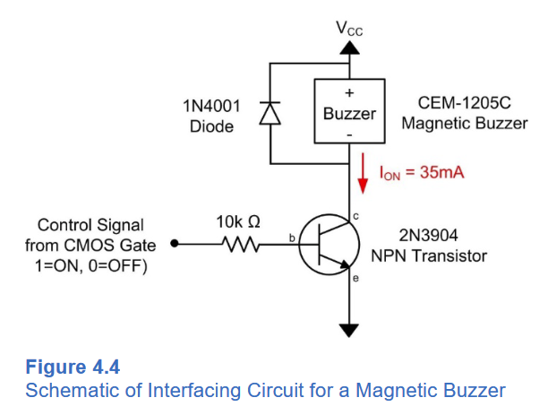

# Buzzer VHDL Component
The buzzer.hdl file consists of the registers to control the frequency and volume of the buzzer. The code will operate the buzzer at the frequency given to the "pitch" register and the volume set by the "volume" register. The base address for the buzzer component is 0x0001 0000.

## Data Type Expectations
The "pitch" register is expecting a binary string that represents the decimal value in Hz the user wants the buzzer to play. The register expects no fractional bits, so the user can only input integer values. The buzzer is operated with a pwm signal where the period and duty cycle can be set. The period is limited from 1 to 31 ms, which corresponds to a frequncy range of 32 Hz to 1000 Hz. The user can only choose frequencies in this range. The volume can be adjusted by changing the duty cycle. There is a register for the duty cycle that expects a 20 bit fixed point value with 19 fractional bits. 

## Buzzer Circuit
When implementing the buzzer, a few additional circuit elements are necessary for proper operation. The schematic, taken from Brock LaMeres' textbook, is here.

>
From "Introduction to Logic Circuits" by Brock J. LaMeres