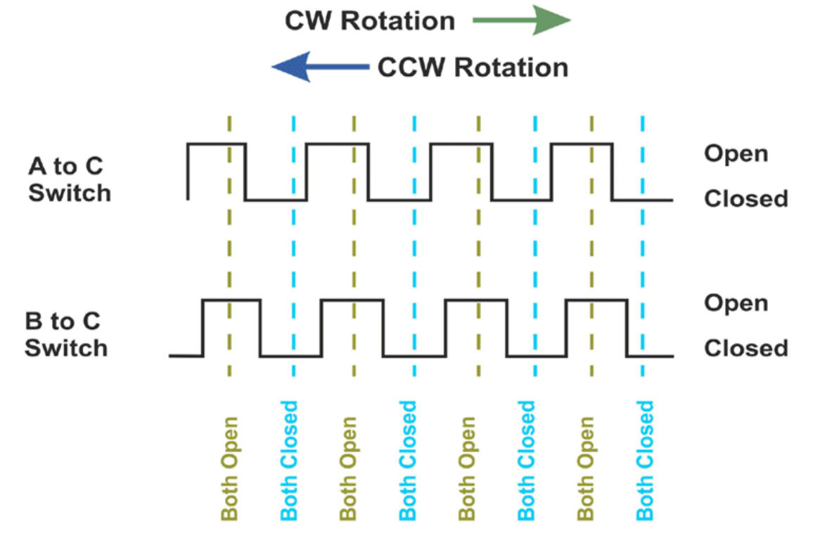

# Rotary Encoder VHDL Component

## Overview
The rotary vhdl component consists of the vhdl process change enable state off a push button and to determine if the rotary encoder is rotating clock wise or counter clock wise. The rotary encoder component also insatiates the avalon registers, whose base address is 0x00030000.

## Data Type Expectations
Nothing should be written to the registers in this component, they should only be read. The Encoder state register should only hold values from 0-63 as this coorisponds to 3 full revolutions of the encoder and we thought this was a good value. The Encoder enable register should only hold a 1 or a zero.

## Enable State
The aysnc conditioner we developed in class was used for the push button for this component. I am not going to write a read me for those as our super cool prof TrevSTAR basically gave us those through the homeworks earlier in the semester
The enable state was determined by the push of the rotary encoder button. This button does need to have a pull up resister and be notted on the top level. A press of the button changes the state. The enable register should be only zero or one. 

## Rotary Encoder

The rotary process was based on the waveform shown above. The A and B input of the rotary encoder are phase shifted by 90 degrees, this means you can determine the direction of rotation by checking the state of B on the rising edge of A. This would increment a state counter(bounded to 0-63) for the rotary encoder. The rotaty encoder register then gets this value.

## Avalon Bus
This component instantiates a pretty standard Avalon bus however, it is read only to the registers, as writing is not needed.
